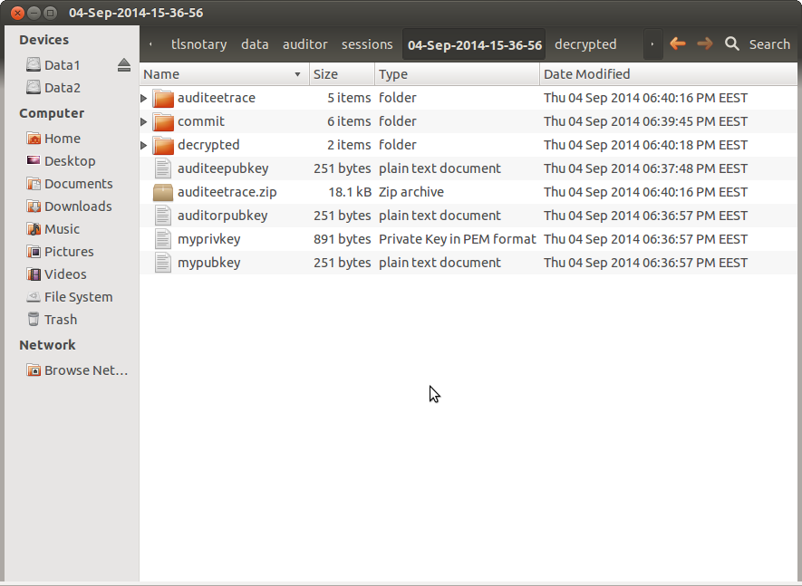

Auditor Usage Instructions
==========================

Using TLSNotary as an auditor requires a more serious investment of time and effort, clearly.
The first steps would be to read the other documentation, starting with the [README](https://github.com/tlsnotary/tlsnotary/blob/master/README.md),
and going on from there. Understanding the cryptography in detail is not a requirement, but you should at least
familiarise yourself with the basics of the algorithm as laid out in the [algorithm whitepaper](TLSNotary.pdf).
To be a little clearer on this point, you don't need to understand the details of TLS 1.0, the PRF modifications 
or the RSA homomorphism, but you need to know how and why, in general terms, the two parties (auditor and auditee) communicate with each other, and be aware of the security issues and defences as laid out in Section 3.

It's also very important that, before you start using TLSNotary in a real audit situation, you become very familiar
with its filesystem layout. In particular, you'll need to get used to where audit records are stored and how to read
them. This is covered in some detail below.

##Preparatory steps

###Setting up IRC.
In the file `tlsnotary.ini` in the `data/shared` directory, there are three settings for IRC. We default to freenode,
the most widely used IRC server, on the standard port 6667. However, you should probably change the IRC channel to one that
you have created and registered. You need to register to enable voicing of new users. Here are the correct steps on freenode:

```
/join #YourChanName
/msg ChanServ REGISTER #YourChanName
/msg ChanServ FLAGS #YourChanName *!*@* +V
```

The correct steps can and will of course differ if you do not use freenode. Note that you need to tell your auditee the name of the channel you're using (and, if not the default freenode, also the server name and IRC port). They will be able to edit these settings in the Advanced tab in the auditee interface.

###Test out TLSNotary.
Once you have your IRC channel, and have recorded its name in `tlsnotary.ini`, you'll need to test it out. Run 
TLSNotary as an ordinary user and do self test for some random pages. Check that you see appropriate output in your
IRC channel; it should look like this:


except that the name of the channel is your chosen name. Notice that all traffic between users is encrypted. The only information you'll see here is the message types (e.g. `aohello`). Due to the encryption, you won't get much in the way of debugging information here when something is not working; watching it in real time during audit may give you some clues though, through these message types as described in the [messaging protocol](TLSNotary_messaging.md), and also by simply observing whether each party is sending anything at all.

Your next task is to review what data was generated by your tests. TLSNotary has two root folders containing audit data, they are:

`data/auditee/sessions` and `data/auditor/sessions`

Each `sessions` directory contains a subdirectory named with a timestamp for each audit run. You may need to set up some kind of administrative system to keep track of which timestamps correspond to which auditee that you deal with (although the data inside should rescue you if you get confused).

Inside the timestamped directory you should see something like this (when the audit is over):



We'll go through all these items one by one:

* **mypubkey, myprivkey,auditorpubkey,auditeepubkey** - copies of the public keys that were used for this audit session, along with *this* user (auditor)'s pub/priv keypair.
* **auditeetrace.zip** - zip file sent by the auditee; it's unzipped in the folder above.
* **commit** - this folder contains the sha256 hashes and related data which the auditee sent to you to prove the content of the audit before you enabled him to decrypt it. You shouldn't need to use this except in very 'deep' debugging cases. If it is missing, the audit will *definitely* not be valid.
* **auditeetrace** - this folder contains the full version(s) of the encrypted traffic that the auditee "promised" (committed to) in the folder `commit`, in files `response1,2..`. The files `cs1`,`IV1` are cipher suite and initialisation vector, respectively, which are needed to enable decryption, and the `md5hmac` file is not really needed but included for legacy reasons (may be dropped later). The numbered suffices of these files (starting with 1 and increasing) refer to the html page being audited, in case more than one is involved (should be rare).
* **decrypted** - this is by far the most important directory. It contains two files - `domain1` and `html-1` (the numbers are as above). The html file is the file you intend to audit. The domain file represents the auditee's **claim** of what server he was accessing. More on this below.

In this initial testing phase, you need to check that the html you see in the `decrypted` folder corresponds with what you saw in the browser when you conducted the test. There is basically no circumstance where there will be a difference, but check anyway (since this is what you'll be doing in real audits). Note that this html was generated by doing standard SSL decryption of the binary data in the `response` file mentioned above.

In case any of the files or folders mentioned above are missing, you must assume that the audit is not valid. Check the console log for clues as to what might have gone wrong.

###How to run a real audit.

Once all of the above is clear and working properly, the next step is to run tests with auditor and auditee on different machines a few times. The other machine can be a VM if that's more convenient, although there's something to be said for testing out the process with a remote friend, as it will mirror real life conditions more accurately. The main thing is to become fully confident of how the process works before using it for real.

The auditor should be started with the command:

`python data/auditor/tlsnotary-auditor.py`

after which you should see this: 


You'll notice:

1. This script opens a tab in your existing Firefox window, if it's open, or starts that version of Firefox. Notice you don't have an extension here; there is no 'AUDIT THIS PAGE' button in the status bar.
2. You have two fields for auditor and auditee pubkey. These long character strings are base64 encoded RSA public keys (4096 bit). Key management is discussed in the next section.
3. You should press "Connect to auditee" **before** the auditee presses "Connect" on his side, so make sure to manage this and help the auditee through the process. You'll need to have some kind of real-time or semi-real time connection (chat, email etc.).
4. The auditee will then do his audit session in the way described in the main [User guide](https://github.com/tlsnotary/tlsnotary/blob/master/README.md#user-guide). During this period you don't need to do anything but wait for the prompts in the window.
5. Once the audit has finished you should see indication of this in the Firefox tab. Here is an example of what you'll see:


Notice the indication that decryption is successful. If it fails for any reason, you will get clear indication of it in the console window as well as on this screen. In that case, the audit, obviously, has failed, and you will have to try again or debug the problem.

Now that the audit session is finished, you can go to the indicated directory and check the decrypted html to conduct the 'human' part of the audit. In this, follow the instructions as above for [Test out TLSNotary](#test-out-tlsnotary).

If the data in the html (which you can easily read in rendered format in the browser by removing the HTTP headers at the top) matches your expectations, there is one crucial manual checking step left before the audit is considered finished, as described in the next section.

###Certificate Checking
In this critical final step, you're going to check there's a proper match between: the name of the site that's being audited, the public key provided and Firefox's report of whether it trusts the certificate that contains that public key.

Open the file `domain1` in the same `decrypted` folder as the html. This will give you a domain name and instructions on how to cross-check that the public key you see here is indeed valid. Next, start up Firefox by doing `python data/auditee/tlsnotary-auditee.py` ([why?](#checking-the-cert-in-the-tlsnotary-profile)) and visit the sitename specified in `domain1`. Then click the padlock in the URL bar, click "More Information", "View Certificate" and you should see a window like this if you follow the instructions:


There is one case in which this process will fail, and it probably isn't very uncommon. If your auditee has been accessing a site/domain which is not directly accessible without logging in, e.g. `loggedin.bank.com`. In many cases, attempting to access such a site without first logging in results in an automated redirect, e.g. to `loggedout.bank.com`. In this case, you clearly can't follow the procedure above, but you can do something else. From the Firefox menu, go to Tools->Certificate Manager->Servers->Add Exception, and in this window:


enter the site name, and press Get Certificate. From here you will be able to see the two crucial facts: does Firefox trust the certificate, and does the public key inside it match the one provided in your `domain1` file. You'll see whether Firefox trusts the certificate in the main panel, and then you can click "View" to find the public key (in the same way as above).
*At the end of this process, click 'Cancel' and not 'Confirm Security Exception'!*

A final note: **remember that the audit cannot be considered to be completed successfully until you perform this certificate check**.

*Technical background*: the attack we are defending against here is the possibility of the auditee creating a fake website, including TLS but with a certificate that's not signed by a trusted Certificate Authority. Firefox, like all browsers, keeps a database of the main Certificate Authorities who issue certificates to reputable companies and sites. So one aspect of our defence is to make sure that the site concerned has such a signed certificate. The other aspect is that we must make sure that the public key used in the asymmetric crypto stage of TLS (the encrypting and sending of the premaster secret from the client to the server) matches the one for this site, as reported by a Certificate Authority that Firefox trusts. (For those interested, 'reported' by the Cert Auth here actually means 'digitally signed by').
It's true that it would *very* hard for an auditee to carry out this attack; because they would have to mess up *your* DNS records of the location of the site, if it's a famous bank, say. But there is no need for us to rely on DNS; it's not perfect, and we can get cryptographic proof outside it by using the CA system.

###Key management.
Your TLSNotary public/private keypair is generated anew when you first start TLSNotary as auditor, and is stored in the folder `data/auditor/recentkeys/myprivkey` and `mypubkey`. Although keys can be regenerated, it's simplest to keep a backup of these keys securely and never change them. It goes without saying that you should practice good OS hygiene to make sure these keys cannot be stolen; keeping yourself un-hacked is part of your role as auditor.

You will also see a file `auditeepubkey` kept in that folder; it's probably self-explanatory, but it's kept for ease of use in case of multiple audits with the same auditee. Whenever you open the auditor window, the "Auditee key" field will be automatically populated with this key; you can of course override, and always check that you have the right key before starting the audit.


###Respecting auditee privacy.
Consider that the html provided by auditees to you for the purpose of audit may contain some sensitive data (including but not only bank transaction records). It would be sound practice to **delete the entire session directory** after (but definitely not before!) the audit decision has been reached and the final payment has been signed. Apart from this, you should of course make sure to only run TLSNotary in a highly secure environment; the details are of course your own responsibility.

##General advice.

If you've gone through all the above preparatory steps, and taken a good amount of time educating yourself about how the whole process works, you are, in principle, ready to do real life auditing. Please consider these points of general advice -  a set of "DOs and DON'Ts":

###DOs:

1. Depending on the software or other environment you're working in, you may need to set out your terms of auditing explicitly with all auditees or perhaps each individual auditee; things like: the fee you charge, the quality of the proof you expect, the channel where the tlsnotary communication will take place, the banks that will be used, and possibility of demand for additional proof in case the first submission is unsatisfactory, in a form befitting a contract. Figure this out in advance, with the help of the software/website/service you're working with.
2. Allow the auditee to make multiple runs if necessary. Auditees should not be stressed by the thought that a failed run means a failed audit; it emphatically does not. However, use your common sense in case an abnormally large number of tries is occurring; set a limit. If the audit has failed after 5 tries, then it has to be considered failed unless you have some other discretionary information.
3. Double check **exactly** what is expected to be confirmed/refuted by the audit, e.g., the **amount**, **currency**, **date**, **sender** and **beneficiary** of the bank transfer (with parties identified unambiguously by account number). Whether the transaction indeed took place after the time agreed upon by both the buyer/seller is also especially important.
4. Make yourself familiar with the bank/payment processors that will be used in your audits. It's recommended that you audit those banks/payment processors you already have an account with. Also, try to be aware of any banking institutions with dubious reputations.  
5. Maintain all the records of auditing systematically in case there are further disputes.
6. Set a timeout period for an *individual* audit session (not to be confused with 2, which refers to multiple sessions).

###DON'Ts

1. Accept any form of 'evidence' that the auditee offers **in place of** TLSNotary audits (assuming this is not explicitly allowed in the contract).
2. Accept the proof from a auditing session that has abnormally terminated, especially not after a long time, as the auditee might increase his chance to brute-force the secret in the extended period of time permitted.
3. Sign the final multisig redemption payment prematurely before you are absolutely certain about the outcome of the audit.


###Checking the cert in the TLSNotary profile
Why start Firefox in the local TLSNotary copy of Firefox with the TLSNotary profile? It's for your convenience. Because the local copy of Firefox (actually stored in `data/auditee/firefoxcopy`), running with tlsnotary's profile, has limited the cipher suites to RSA cipher suites. Specifically, they are: 

```
security.ssl3.rsa_aes_128_sha
security.ssl3.rsa_aes_256_sha
security.ssl3.rsa_rc4_128_md5
security.ssl3.rsa_rc4_128_sha
```

You could also start the normal copy of Firefox and edit the set of cipher suites: go to about:config and type ssl3 in the search bar. This gives the full list of enabled cipher suites. Switch all to "false" except the above 4. Then follow the instructions. (Remember to reset to defaults afterwards to avoid browsing problems).
